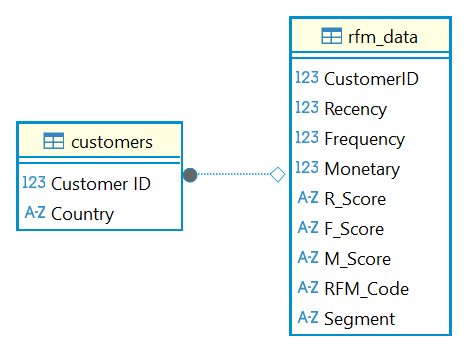

# 📊 Customer Segmentation using RFM Analysis
### End-to-End Project: Python + SQL + SQLite + ER Diagram

> From raw data → RFM analysis → relational database → documented schema
> Built step-by-step: Python processing → SQLite design → SQL queries → ER Diagram

---

## 📋 Project Overview

This project applies **RFM Analysis** (Recency, Frequency, Monetary) to classify customers based on their purchasing behaviour — then stores the results in a **fully designed relational database** ready for querying and sharing.

**Built in two phases:**
- ✅ **Phase 1** — Python: Data cleaning, RFM calculation, segmentation
- ✅ **Phase 2** — SQL: Database design, table relationships, ER Diagram, analysis queries

---

## 📁 Dataset

| Detail | Information |
|---|---|
| **Source** | Online Retail Dataset |
| **File** | Included in project files |
| **Time Period** | 01/12/2010 — 09/12/2011 |
| **Transactions** | 541,909+ |

---

## 🧠 Phase 1 — Python & RFM Analysis

### What is RFM?
| Metric | Meaning |
|---|---|
| **Recency** | Days since the customer's last purchase |
| **Frequency** | Total number of purchases |
| **Monetary** | Total amount spent |

### Steps Completed
1. Loaded & cleaned transaction data
2. Calculated spending per transaction
3. Aggregated per customer → RFM values
4. Assigned scores **1–5** (5 = highest value)
5. Combined scores → **7 distinct segments**

### Customer Segments
| Segment | Description |
|---|---|
| 🏆 **Champions** | Highest Recency + Frequency + Monetary — most valuable |
| 💎 **Loyal Customers** | Buy frequently and recently |
| 💰 **High Spenders** | Largest total spending |
| ✅ **Active** | Recent and consistent engagement |
| ⚠️ **At Risk** | Previously active but not recent |
| ❌ **Lost** | No recent activity — needs re-engagement |
| 🆕 **New** | New or low-activity customers |

---

## 🗄️ Phase 2 — SQL Database & ER Diagram ✨

### Database Design
**Two linked tables** in SQLite:

| Table | Purpose |
|---|---|
| `customers` | Customer ID + Country information |
| `rfm_data` | RFM metrics, scores, RFM code, Segment label |
### Entity-Relationship Diagram



- **Relationship:** One-to-One — each customer has exactly one RFM record
- **File:** `Customer_Segmentation_ER_Diagram-1.png`
- **Database:** `customer_database.db`
- **Created in:** DBeaver
-
---

## 💡 Key SQL Queries

### Join Customer Details with RFM Results
```sql
SELECT 
    c."Customer ID",
    c.Country,
    r.Recency,
    r.Frequency,
    r.Monetary,
    r.Segment
FROM customers c
INNER JOIN rfm_data r 
    ON c."Customer ID" = r.CustomerID;
## Revenue & Customer Count by Segment
SELECT 
    Segment,
    COUNT(*) AS Total_Customers,
    ROUND(SUM(Monetary), 2) AS Total_Revenue
FROM rfm_data
GROUP BY Segment
ORDER BY Total_Revenue DESC;

